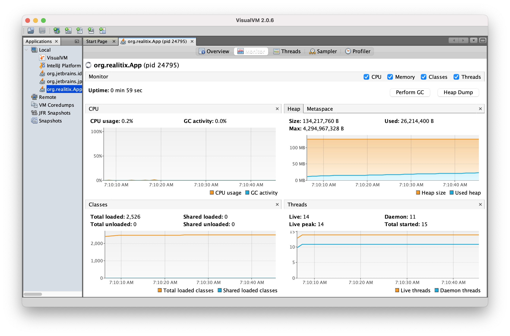

# Memory test for Classic Producer Consumer

Vary the queue size, producer rate, consumer rates, # of producers, # of consumers, delays, etc.

Disclaimer: All configs are in in `Constants` interface. Note that this is only a test program, and not intended to be deployed as an e2e solution. Therefore, best practices regarding program configuration, tests and deployments may not be adhered to here.